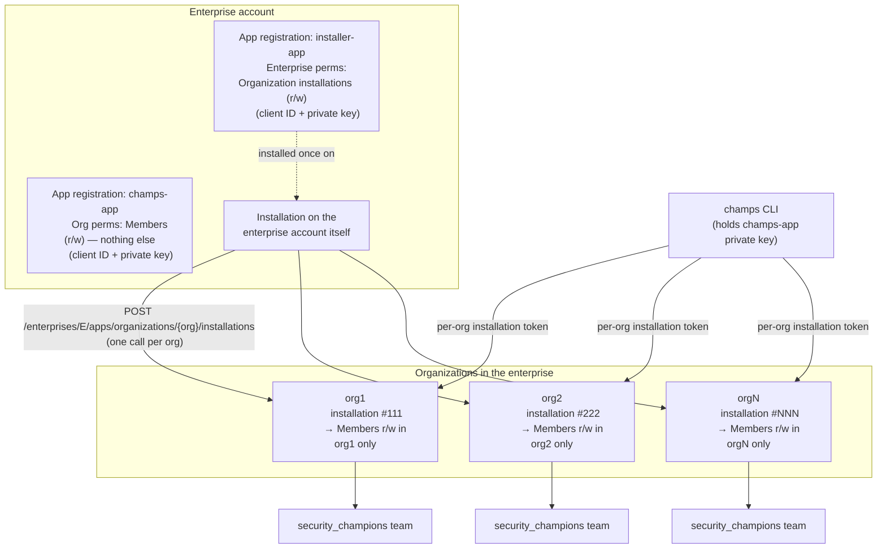
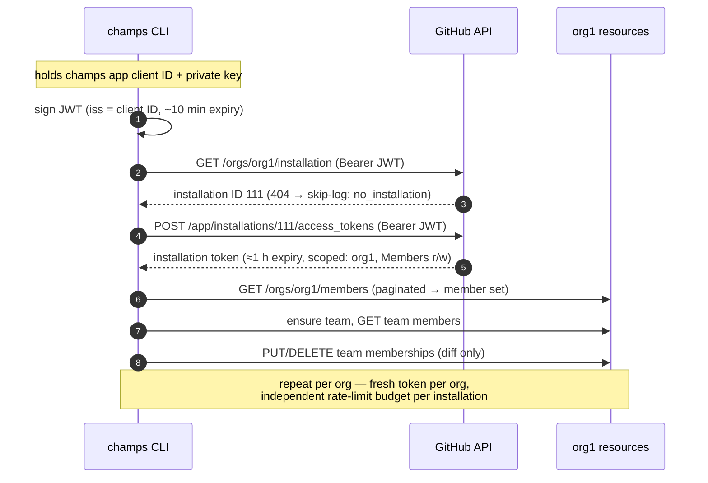

# champs GitHub App — Setup Guide

Companion to **DESIGN-0001: champs: security champions team management CLI**.
This document covers exactly how to register, install, and authenticate the
enterprise-owned GitHub App that `champs` runs as, following the same pattern as
repo-guardian.

## The model in one diagram

Registration and installation are separate things. The **enterprise account owns
the app registrations** (name, private key, permission manifest) — ownership
grants no access. **Installations** are the per-org grants: each one gives the
app its requested permissions on that org only.



Key properties of this shape:

- The champs app registration carries **only**
  `Organization permissions → Members: read & write`. No repository permissions,
  no enterprise permissions. A leaked champs key can touch org membership reads
  and team membership — nothing else.
- Enterprise permissions (the ability to install apps into orgs) live on the
  **installer app**, which is a separate registration with a separate key. If
  repo-guardian already has an installer app, reuse it — do not create a second
  one.
- Each org installation has its own installation ID, its own short-lived tokens,
  and its own independent rate-limit budget.
- Enterprise-owned apps can only be installed on the enterprise or orgs within
  it — they are structurally incapable of being installed outside, so there is
  no "accidentally public" failure mode.

## Step 1 — Register the champs app

1. Go to `https://github.com/enterprises/<ENTERPRISE>/settings/apps` → **New
   GitHub App**.
2. Settings:
   - **Name:** `champs` (or your app naming convention)
   - **Homepage URL:** the champs repo URL (required field; anything sensible
     works)
   - **Webhook:** deselect **Active**. champs is a pull-based CLI; it needs no
     webhook, and an inactive webhook means no endpoint to host or secure.
   - **Expire user authorization tokens:** deselect (champs never signs in
     users, but this avoids a pointless setting).
   - **Repository permissions:** none.
   - **Organization permissions:** **Members → Read and write**. This single
     permission covers listing org members, creating teams, updating team
     settings, and adding/removing team members.
   - **Enterprise permissions:** none.
3. Create the app. Record the **App ID** and **Client ID**.
4. Scroll down → **Generate a private key**. A `.pem` downloads.
5. Store the `.pem` in AWS Secrets Manager (or SSM Parameter Store,
   SecureString). The key never lives in a repo, a laptop, or an Actions secret
   directly — the workflow reads it from the secrets backend at runtime via
   OIDC-assumed role.

> The registration alone now exists but can do nothing anywhere. Access only
> materializes in Step 3.

## Step 2 — Installer app (reuse if it exists)

The installer app is what turns "install into 200 orgs" from a clickfest into a
loop. **Check whether one already exists from the repo-guardian rollout** at
`https://github.com/enterprises/<ENTERPRISE>/settings/apps`. If yes, skip to
Step 3.

If not:

1. Same **New GitHub App** flow. Name it `<enterprise>-installer` per
   convention.
2. Webhook inactive, no repository permissions, no organization permissions.
3. **Enterprise permissions:** **Enterprise organization installations → Read
   and write**. This is the one permission that authorizes installing apps into
   member orgs.
4. Create, record Client ID, generate and store the private key.
5. In the app's sidebar → **Install App** → install it **on the enterprise
   account itself**. Note the installation ID from the resulting URL
   (`/enterprises/<ENTERPRISE>/settings/installations/<ID>`) — or look it up via
   `GET /enterprises/<ENTERPRISE>/installation` (public preview, added May
   2026), authenticating with the installer's JWT.

> **API status (as of July 2026):** enterprise-owned app _registrations_ are GA
> (March 2025), but the enterprise-level access pattern and installation
> automation APIs are **public preview** (July 2025), as is the
> installation-discovery endpoint above (May 2026). They work and are documented
> with an official guide, but preview means possible breaking changes and no
> support commitment — pin `X-GitHub-Api-Version`, watch the changelog, and keep
> the manual install path (org settings UI / install link) documented as
> fallback. Not all enterprise endpoints support app authentication yet; some
> enterprise-admin operations still require a classic PAT.

## Step 3 — Install champs into every org

Authenticate the installer app, then loop the install endpoint over the org
list. Using `gh` for clarity (in practice this is a script fed by the same org
list as `champs.hcl`):

```bash
# 1. JWT for the installer app (client ID + its private key)
INSTALLER_JWT=$(gen-jwt.sh "$INSTALLER_CLIENT_ID" installer.private-key.pem)

# 2. Exchange JWT for an enterprise-scoped installation token
INSTALLER_TOKEN=$(gh api --method POST \
  "/app/installations/${INSTALLER_INSTALL_ID}/access_tokens" \
  --header "Authorization: Bearer ${INSTALLER_JWT}" --jq .token)

# 3. Install champs into each org
for ORG in $(cat orgs.txt); do
  gh api --method POST \
    "/enterprises/${ENTERPRISE}/apps/organizations/${ORG}/installations" \
    --header "Authorization: Bearer ${INSTALLER_TOKEN}" \
    --header "X-GitHub-Api-Version: 2022-11-28" \
    --field "client_id=${CHAMPS_CLIENT_ID}"
done
```

Notes:

- The endpoint takes the **client ID of the app being installed** — the
  installer token authorizes the act, the client ID says which app.
- `repository_selection` is irrelevant for champs (it requests no repository
  permissions) and can be omitted.
- The call is effectively idempotent for our purposes — an org that already has
  the installation returns an "already installed" error, which the loop treats
  as success.
- Run this same loop whenever a new org joins the enterprise (see Ongoing
  operations).

## Step 4 — Verify

Spot-check in the UI at
`https://github.com/organizations/<ORG>/settings/installations` — champs should
be listed. Or programmatically with the **champs** app's own credentials:

```bash
CHAMPS_JWT=$(gen-jwt.sh "$CHAMPS_CLIENT_ID" champs.private-key.pem)
gh api "/orgs/${ORG}/installation" \
  --header "Authorization: Bearer ${CHAMPS_JWT}" --jq .id
```

A 200 with an installation ID means installed; a 404 means not installed — which
is precisely the check champs performs at runtime to emit `no_installation`
skip-log entries instead of crashing.

## Step 5 — How champs authenticates at runtime



Implementation notes for the CLI:

- One JWT can mint tokens for many installations; regenerate it when it nears
  its ~10-minute expiry rather than per org.
- Cache the org → installation-ID mapping per run; don't persist it
  (installations can be removed).
- Installation tokens expire after about an hour — comfortably more than any
  single org's reconcile. Mint per org, discard after.
- The `go-github` + `ghinstallation` transport handles the JWT/token dance; the
  skip-log `no_installation` path is the only custom handling needed.

## Ongoing operations

**Key rotation.** GitHub App registrations support two private keys
simultaneously: generate the new key, update Secrets Manager, confirm champs
runs cleanly, then delete the old key from the registration. Same procedure for
the installer app on its own cadence.

**Permission changes.** If champs ever needs a new permission, edit the manifest
on the enterprise-owned registration. Changes made by an enterprise owner are
auto-accepted by orgs in the enterprise — no per-org approval chase.

**New orgs.** Joining the enterprise does not install anything. Onboarding an
org = run the Step 3 loop for it (or re-run for the full list; already-installed
orgs no-op) + add it to `champs.hcl`. Until both happen, champs reports it as
`no_installation` — the skip log is the drift detector for this, too.

**Uninstall / decommission.** Uninstalling the app from an org (org settings →
installations) immediately revokes that installation's tokens. Deleting the
registration revokes everything everywhere.

## References

- GitHub Docs — Automating app installations in your enterprise's organizations
  (installer-app pattern, install endpoint)
- GitHub Docs — Creating GitHub Apps for your enterprise (enterprise-owned
  registration, auto-accepted permission changes)
- GitHub Docs — Installing your own GitHub App (visibility rules for
  enterprise-owned apps)
- GitHub REST — Apps: create an installation access token; Enterprise admin:
  organization installations
- GitHub Changelog — Enterprise-level access for GitHub Apps and installation
  automation APIs (2025-07-01)
